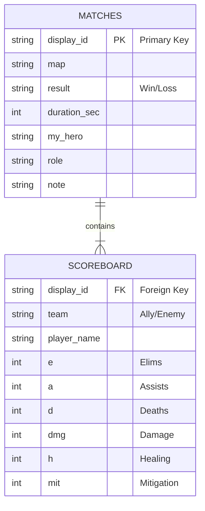

# Overwatch Competitive Data Analysis & Outcome Prediction

### Project Overview
This project is a statistical study based on a dataset of 100 personal competitive matches in Overwatch 2 (North America, Solo Queue, DPS Role, Diamond 5 - Master 5 range).

The primary objective is to identify statistical correlations between scoreboard metrics and match outcomes. The project explores whether winning and losing teams exhibit distinct data patterns and if match results can be predicted solely based on "snapshot" data from the scoreboard (KDA, MIT, Damage, Healing) during a game.

### Research Hypothesis
Can the final outcome of a match (Win/Loss) be predicted by analyzing the scoreboard data of the participating teams?
*   Do winning teams share specific statistical characteristics regardless of the map or game mode?
*   Is there a "winning formula" visible in the raw numbers that transcends hero composition?
*   Can a snapshot of data at a specific timestamp determine which team is currently in the winning position?

### Dataset Specifications
The dataset consists of 100 manually tracked matches with the following variables:
*   **Match Context:** Date, Time, Duration, Map, Game Mode.
*   **Rank/Environment:** NA Region, Solo Queue, Diamond/Master Tier.
*   **Team Composition:** Hero selections for both allied and enemy teams.
*   **Scoreboard Metrics:** Kills, Deaths, Assists, Damage, Healing, and Mitigation (MIT) for all 10 players.

### Data Structure & Schema
The data is organized into a relational database to facilitate querying and pattern recognition. The schema links match environments (Maps) to performance metrics (Scoreboard).

### Data Structure & Schema
The data is organized into a relational database linking match environments to player performance metrics.

### Analytical Goals
1.  **Pattern Recognition:** Identify if high variance in specific stats (e.g., support deaths vs. tank damage) correlates strongly with loss rates.
2.  **Snapshot Prediction:** Test if looking at the scoreboard at the 5-minute or 10-minute mark can accurately predict the final winner.
3.  **Composition Analysis:** Analyze if certain statistical thresholds are required for specific compositions to succeed in the Diamond-Master bracket.

### Current Status
*   Data collection for the initial N=100 sample set is complete.
*   SQL database construction and normalization are in progress.
*   Preliminary analysis of "Winning Team" statistical profiles is underway.
Data Analysis & Project Impact: From Diamond 5 to Master 5

This project evolved from a data collection exercise into a **personal decision-support system**. By applying statistical modeling to the "noisy" ranked environment, I achieved a measurable performance improvement, climbing from Diamond 5 to Master 5.

#### 1. Statistical Evidence (Logistic Regression Model)
I performed a Logistic Regression analysis on a subset of 50 matches to identify the most significant predictors of victory.

*   **Model Fit:** The model demonstrated strong explanatory power (Pseudo R² ≈ 0.665, LLR p-value ≈ 2.6e-9).
*   **The "Net Kills" Variable:** The metric `(Eliminations - Deaths)` was the only statistically significant variable (p=0.0069) amidst the noise.
*   **Odds Ratio (1.461):** Controlling for other variables, **every +1 increase in Net Kills increases the odds of winning by approximately 46%**.
    *   *In practical terms:* Within the common win-rate range (30%-70%), saving your own life once (while maintaining impact) translates to an absolute win probability increase of roughly **8-10%**.

#### 2. Role-Based Insights
The analysis revealed distinct statistical profiles between winning and losing teams:
*   **Tank:** Winners consistently showed high elimination counts and significantly lower deaths.
*   **DPS (Damage):** Winning DPS players often had **lower raw damage** but higher eliminations compared to losers. This indicates "efficient damage" (securing kills) is far more valuable than "trash damage" (feeding enemy supports).
*   **Support:** Survival is paramount. While DPS deaths are naturally higher, a Support's survival correlates strongly with team sustainability.

#### 3. Behavioral Adjustment (The "Snapshot" Strategy)
These insights transformed my in-game psychology and decision-making:

*   **Real-Time Assessment:** By analyzing the scoreboard "snapshot" mid-game, I can predict the match outcome probability.
*   **Resource Allocation (Mental):**
    *   *Clear Loss Signals:* If the statistical gap is insurmountable early on, I avoid "lock-in" or tilt, conserving mental energy.
    *   *Close Matches:* Recognizing tight statistical margins allows me to "put more effort" into high-leverage plays.
*   **Strategic Pivot:** If losing, I actively shift my playstyle to mimic "Winner Data" profiles—prioritizing survival (increasing the E-D ratio) over raw damage output.

#### Conclusion
**The value of data lies not just in its purity, but in its utility.**
Despite the inherent noise of Overwatch 2 match data, this project proved that correct analysis can isolate the signal from the noise, providing a tangible competitive edge.
---
© 2025 Jesse Luo.
